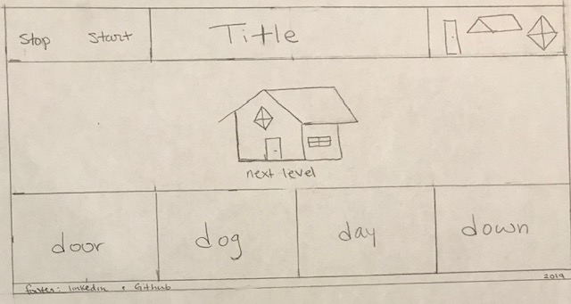

# ** Read to Build** 
## General Assembly Project 1 - Creating a game to help young minds practice reading. 

Link to the live game: https://arig150.github.io/readToBuild/

## Purpose of the project:
When assigned this project I decided to stear away from violent games and create something that could have a longer lasting impact on the player. After considering different options, I decided to create a game to help young children practice their reading comprehension.  

## Prerequisites 
Use HTML, CSS, and JavaScript to create a game used in the browser. The game must have a multi player option, or multiple levels. Adhere to best practices for semantic markup for HTML and CSS files, use JavaScript or jQuery for DOM manipulation, and deploy your game online. 

## Objectives of the game
Purpose: Creating an engaging way for a small child to practice reading.
Method:  In every level the user is attempting to build an item. Every level is broken into 3 different tasks. After each task is completed, the item has been built, and the level has been won. In order to complete each task the player must match the correct word on the bottom of the page, for instance 'chair', to the image of the chair in the center.

## Day 1 
Spent the day considering the objectives of the game. I created the wireframing, flow chart, pseudocode, and images for the first level. I found myself very lost in past class assignments where I did not spend enough time psuedocoding, so I was very deliberate in the planning of this assignment. 

## Day 2
Created the basics of the game: the HTML, CSS, and JavaScript for level 1. Spent the day implementing the click function for the different tasks within the level and having the images appear and dissapear where needed. 

## Day 3 
Focused on scaling level 1 into level 2. Created the play button, reset, and next level functionalities. 

## Day 4
I spent most of the day considering the visual aspect of the game. I realized that the intended users of this game would need 'start', 'reset' and 'next level' buttons that relied on iconography and not written word. Changed fonts, sizing, and some other smaller CSS details. 

## Day 5 
Fixed small bugs to improve user flow, included sound effects, and created the footer. 

## Moving Forward 
Rewrite the code to make it more easily scalable. Randomize the word options. Create more levels that steadily increase in difficulty. Include animations to further engage children. 

## Technologies Used
-HTML
-CSS
-JavaScript 

## External Sources
-Google Fonts
-Font Awesome
-Mozilla Developers Network
-W3Schools
-StackOverflow
-General Assembly teachers and tutors. 
